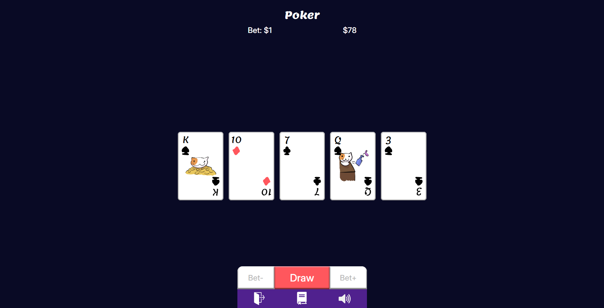

# Video Poker


Poker 5-card draw made entirely in React, with TypeScript for the logic, and Zustand for the state management.

The application is divided into three:
- ### Home page
Where the player can create a new account or sign into an existing one.

- ### Rules page
Where the rules are written, as well as a table with the different hand ranks and their payouts.

- ### Game page
Where the game takes place. Here the player can bet, draw, and hold cards.

## Technologies
- Vite
- React
- TypeScript
- Zustand

## Install Packages
```
npm i
```

## Start the app
```
npm run dev
```

